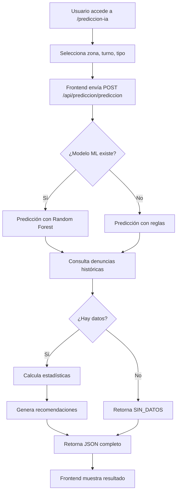

# 🤖 Sistema de Predicción IA de Delitos

## 📋 Descripción

Este módulo utiliza **Machine Learning (Random Forest)** para predecir el **nivel de riesgo de delitos** en una zona específica basándose en:

- **Zona** (1-7) - Área geográfica
- **Turno** (mañana, tarde, noche) - Período del día
- **Tipo de delito** (opcional) - 15 tipos predefinidos
- **Día de la semana** (calculado automáticamente)
- **Hora** (calculada automáticamente según turno)
- **Mes** (mes actual del sistema)

## 🎯 Niveles de Riesgo

| Nivel            | Descripción                       | Criterios                        |
| ---------------- | --------------------------------- | -------------------------------- |
| **ALTO** 🔴      | Requiere patrullaje inmediato     | Predicción ML o ≥ 5 incidentes   |
| **MEDIO** 🟡     | Patrullaje preventivo recomendado | Predicción ML o 2-4.9 incidentes |
| **BAJO** 🟢      | Monitoreo estándar                | Predicción ML o < 2 incidentes   |
| **SIN_DATOS** ⚪ | No hay información histórica      | 0 denuncias en ese contexto      |

## 🚀 Uso del API

### 1. Endpoint de Predicción

```http
POST /api/prediccion/prediccion
Content-Type: application/json

{
  "zona": 3,
  "turno": "noche",
  "tipo_denuncia": "robo",
  "dia_semana": 5
}
```

**Respuesta exitosa:**

```json
{
  "zona": 3,
  "turno": "noche",
  "nivel_riesgo": "ALTO",
  "total_denuncias": 45,
  "densidad_diaria": 6.4,
  "tipos_denuncias": [
    { "tipo": "robo", "cantidad": 23 },
    { "tipo": "violencia_familiar", "cantidad": 12 },
    { "tipo": "vandalismo", "cantidad": 10 }
  ],
  "recomendaciones": [
    "⚠️ Riesgo ALTO detectado - Se recomienda patrullaje inmediato",
    "📍 Zona 3 requiere atención prioritaria",
    "🚔 Desplegar unidades adicionales en turno noche"
  ],
  "metodo_prediccion": "ml" // "ml" o "reglas"
}
```

**Respuesta sin datos:**

```json
{
  "zona": 10,
  "turno": "mañana",
  "nivel_riesgo": "SIN_DATOS",
  "total_denuncias": 0,
  "mensaje": "No hay suficientes datos históricos para esta zona y turno"
}
```

### 2. Estadísticas por Zona

```http
GET /api/prediccion/estadisticas/zona/1
```

### 3. Ranking de Zonas de Riesgo

```http
GET /api/prediccion/zonas-riesgo?turno=noche
```

## 📊 Interfaz Web

Accede a la interfaz en: <http://localhost:8000/prediccion-ia>

La interfaz permite:

- ✅ Seleccionar zona (1-7) mediante dropdown
- ✅ Seleccionar turno (mañana, tarde, noche)
- ✅ Seleccionar tipo de delito (15 tipos predefinidos)
- ✅ Ver predicción en tiempo real con ML
- ✅ Visualizar recomendaciones personalizadas
- ✅ Consultar estadísticas de delitos más frecuentes
- ✅ Mensaje especial cuando no hay datos históricos

### Tipos de Delitos Disponibles

1. Robo
2. Violencia familiar
3. Vandalismo
4. Asalto
5. Hurto
6. Fraude
7. Acoso
8. Amenazas
9. Lesiones
10. Extorsión
11. Secuestro
12. Homicidio
13. Violación
14. Tráfico de drogas
15. Otro

## 🎓 Modelo de Machine Learning

El sistema utiliza **Random Forest Classifier** con las siguientes características:

### Arquitectura del Modelo

- **Algoritmo**: Random Forest (ensemble de árboles de decisión)
- **Features utilizadas**: 6 características
  1. `zona` (1-7)
  2. `turno_encoded` (0=mañana, 1=tarde, 2=noche)
  3. `tipo_encoded` (codificación numérica del tipo)
  4. `hora` (6=mañana, 14=tarde, 22=noche)
  5. `dia_semana` (0=lunes ... 6=domingo)
  6. `mes` (1-12)
- **Target**: `nivel_riesgo` (ALTO, MEDIO, BAJO)
- **Split**: 80% entrenamiento / 20% prueba

### Requisitos

```bash
pip install scikit-learn numpy
```

### Entrenar el Modelo

```bash
python -m app.services.train_ml_model
```

**Salida esperada:**

```text
✅ Datos cargados: 120 registros
📊 Conjunto de entrenamiento: 96 muestras
� Conjunto de prueba: 24 muestras
✅ Modelo entrenado exitosamente
Precisión en datos de prueba: 62.50%

� Importancia de features:
  - hora: 25.3%
  - mes: 19.7%
  - zona: 18.8%
  - dia_semana: 17.4%
  - tipo_encoded: 9.5%
  - turno_encoded: 9.3%

✅ Modelo guardado en models/prediccion_delitos.pkl
```

### Carga Automática del Modelo

El modelo se carga automáticamente al iniciar el servidor:

```python
# En app/routers/prediccion_ia.py (líneas 28-32)
model_path = Path("models/prediccion_delitos.pkl")
if model_path.exists():
    with open(model_path, 'rb') as f:
        model_data = pickle.load(f)
        modelo_ml = model_data['model']
        label_encoder = model_data.get('label_encoder')
        print("✅ Modelo ML cargado desde", model_path)
```

**Consola al iniciar servidor:**

```text
✅ Modelo ML cargado desde models\prediccion_delitos.pkl
INFO: Started server process [18580]
INFO: Application startup complete.
```

## 📈 Algoritmo de Predicción

El sistema utiliza un **enfoque híbrido** que combina ML y reglas:

### 1. Predicción con Machine Learning (Preferida)

Si el modelo `prediccion_delitos.pkl` existe:

```python
# Preparar features
features = np.array([[
    zona,              # Zona seleccionada
    turno_encoded,     # 0=mañana, 1=tarde, 2=noche
    tipo_encoded,      # Código numérico del tipo
    hora,              # 6, 14 o 22
    dia_semana,        # 0-6
    mes                # 1-12
]])

# Predecir
prediccion = modelo_ml.predict(features)
nivel_riesgo = prediccion[0]  # "ALTO", "MEDIO" o "BAJO"
```

### 2. Fallback con Sistema Basado en Reglas

Si el modelo ML no está disponible o falla:

1. **Consulta histórico** de denuncias con filtros zona/turno
2. **Calcula densidad diaria** = total_denuncias / días_periodo
3. **Determina nivel** según umbrales:
   - `densidad >= 5` → **ALTO**
   - `densidad >= 2` → **MEDIO**
   - `densidad < 2` → **BAJO**
4. **Caso especial**: Si `total_denuncias == 0` → **SIN_DATOS**

### 3. Validación y Respuesta

- Consulta tipos de denuncias más comunes
- Genera recomendaciones específicas según el nivel
- Retorna respuesta JSON completa

## 🔧 Personalización

### Ajustar Número de Zonas

Edita `app/main.py` línea 149:

```python
# Cambiar rango de zonas (actualmente 1-7)
zonas_disponibles = list(range(1, 8))  # Modificar 8 al número deseado + 1
```

### Ajustar Umbrales de Riesgo

Edita `app/routers/prediccion_ia.py` líneas ~210-215:

```python
# Sistema basado en reglas (fallback)
if densidad_diaria >= 5:      # Cambiar umbral ALTO
    nivel_riesgo = "ALTO"
elif densidad_diaria >= 2:    # Cambiar umbral MEDIO
    nivel_riesgo = "MEDIO"
else:
    nivel_riesgo = "BAJO"
```

### Agregar Nuevos Tipos de Delitos

Edita `templates/prediccion-ia.html` líneas ~33-50:

```html
<select class="form-select" name="tipo">
  <option value="">Selecciona un tipo</option>
  <option value="robo">Robo</option>
  <!-- Agregar más opciones aquí -->
  <option value="nuevo_tipo">Nuevo Tipo</option>
</select>
```

## 📊 Métricas y Rendimiento del Modelo

### Evaluar el Modelo Entrenado

El script de entrenamiento muestra automáticamente:

```text
Precisión en datos de prueba: 62.50%

Reporte de clasificación:
              precision    recall  f1-score   support

        ALTO       0.65      0.87      0.74        15
       MEDIO       0.50      0.22      0.31         9

    accuracy                           0.63        24
```

### Interpretación de Métricas

- **Precisión global**: 62.5% - Predicciones correctas del total
- **Clase ALTO**: 65% precisión, 87% recall (detecta bien los casos de alto riesgo)
- **Clase MEDIO**: 50% precisión, 22% recall (necesita más datos)

### Mejorar el Modelo

Para aumentar la precisión:

1. **Recolectar más datos**: Idealmente 500+ denuncias
2. **Balancear clases**: Asegurar ejemplos de ALTO/MEDIO/BAJO
3. **Re-entrenar periódicamente**: Cada 1-2 meses con nuevos datos

```bash
# Re-entrenar con datos actualizados
python -m app.services.train_ml_model
```

## 🎯 Casos de Uso

### 1. Planificación de Patrullaje

```python
# Consultar riesgo para todas las zonas en turno noche
for zona in range(1, 8):
    response = requests.post(
        "http://localhost:8000/api/prediccion/prediccion",
        json={"zona": zona, "turno": "noche"}
    )
    print(f"Zona {zona}: {response.json()['nivel_riesgo']}")
```

### 2. Asignación Dinámica de Recursos

- **ALTO**: 3+ patrullas
- **MEDIO**: 2 patrullas
- **BAJO**: 1 patrulla de rutina

### 3. Prevención Proactiva

- Identificar patrones antes de que ocurran delitos
- Desplegar recursos preventivamente
- Reducir tiempos de respuesta

### 4. Análisis Temporal

- Comparar riesgo por día de la semana
- Identificar horarios críticos
- Optimizar turnos de trabajo

### 5. Reportes Gerenciales

- Justificar asignación de presupuesto
- Demostrar efectividad de patrullaje
- Tomar decisiones basadas en datos

## 🔄 Flujo de Trabajo Completo



## 🚀 Optimizaciones Futuras

### Corto Plazo

- [ ] Agregar cache para predicciones frecuentes
- [ ] Implementar API de batch predictions
- [ ] Exportar reportes en PDF/Excel

### Mediano Plazo

- [ ] Entrenar modelos específicos por zona
- [ ] Incorporar datos meteorológicos
- [ ] Agregar análisis de series temporales

### Largo Plazo

- [ ] Deep Learning con redes neuronales
- [ ] Predicción de coordenadas exactas
- [ ] Integración con cámaras de seguridad
- [ ] Sistema de alertas automáticas

## 🐛 Solución de Problemas

### Error: "ModuleNotFoundError: No module named 'sklearn'"

**Causa**: scikit-learn no está instalado

**Solución**:

```bash
pip install scikit-learn numpy
```

### Error: "No se cargó el modelo ML"

**Causa**: El archivo `models/prediccion_delitos.pkl` no existe

**Solución**:

```bash
# Entrenar el modelo primero
python -m app.services.train_ml_model

# Reiniciar el servidor
python run_server.py
```

### Mensaje: "SIN_DATOS"

**Causa**: No hay denuncias históricas para esa zona/turno

**Solución**:

- Selecciona una zona/turno diferente con más datos
- O importa más denuncias desde Excel
- El sistema funcionará con reglas básicas mientras tanto

### Error 422: Unprocessable Content

**Causa**: Formato incorrecto de la petición JSON

**Solución**: Verifica que envías JSON válido:

```json
{
  "zona": 3, // Número entero 1-7
  "turno": "noche", // String: "mañana", "tarde" o "noche"
  "tipo_denuncia": "", // String opcional
  "dia_semana": 5 // Número 0-6 (opcional)
}
```

### Predicciones siempre BAJO

**Causa**: Pocos datos en la base de datos

**Solución**:

1. Importa más denuncias históricas
2. Re-entrena el modelo con más datos
3. Ajusta los umbrales en `prediccion_ia.py`

### El modelo no mejora la precisión

**Recomendaciones**:

- Necesitas mínimo 200-300 denuncias para buenos resultados
- Asegúrate de tener datos balanceados (ALTO/MEDIO/BAJO)
- Considera usar más features si están disponibles

## 📚 Referencias y Recursos

### Documentación Técnica

- [Scikit-learn Random Forest](https://scikit-learn.org/stable/modules/generated/sklearn.ensemble.RandomForestClassifier.html)
- [FastAPI Documentation](https://fastapi.tiangolo.com/)
- [Pydantic Models](https://docs.pydantic.dev/)

### Papers y Artículos

- [Predictive Policing](https://en.wikipedia.org/wiki/Predictive_policing)
- [Crime Pattern Analysis](https://www.ojp.gov/ncjrs/virtual-library/abstracts/crime-pattern-analysis)
- [Machine Learning for Public Safety](https://arxiv.org/search/?query=machine+learning+crime+prediction)

### Herramientas Relacionadas

- **Pandas**: Análisis de datos históricos
- **NumPy**: Operaciones numéricas eficientes
- **Pickle**: Serialización del modelo ML

## 📝 Notas Técnicas

### Formato de Request

El endpoint acepta **JSON** (no form-urlencoded):

```javascript
// ✅ Correcto
fetch("/api/prediccion/prediccion", {
  method: "POST",
  headers: { "Content-Type": "application/json" },
  body: JSON.stringify({ zona: 3, turno: "noche" }),
});

// ❌ Incorrecto
fetch("/api/prediccion/prediccion", {
  method: "POST",
  body: new FormData(form), // No usar FormData
});
```

### Codificación de Turnos

```python
turno_map = {
    "mañana": (0, 6),   # codigo=0, hora=6
    "tarde": (1, 14),   # codigo=1, hora=14
    "noche": (2, 22)    # codigo=2, hora=22
}
```

### Persistencia del Modelo

El modelo se guarda con pickle:

```python
model_data = {
    'model': modelo,
    'label_encoder': le,
    'feature_names': ['zona', 'turno_encoded', 'tipo_encoded',
                      'hora', 'dia_semana', 'mes']
}
pickle.dump(model_data, open('models/prediccion_delitos.pkl', 'wb'))
```

---

## ✅ Checklist de Implementación

- [x] Instalar dependencias (scikit-learn, numpy)
- [x] Entrenar modelo ML con datos de producción
- [x] Implementar endpoint `/api/prediccion/prediccion`
- [x] Crear interfaz web en `/prediccion-ia`
- [x] Integrar Pydantic para validación
- [x] Cambiar formato de Form a JSON
- [x] Agregar manejo de caso SIN_DATOS
- [x] Implementar sistema de fallback con reglas
- [x] Agregar selects para zona/turno/tipo
- [x] Eliminar opción "madrugada" inexistente
- [x] Fix de zona (integer en vez de string)
- [x] Documentación completa

---

**🎉 Sistema de Predicción IA - Operativo y Documentado**

_Desarrollado para SafeData Intelligence_ 🚔

_Última actualización: Noviembre 2025_
